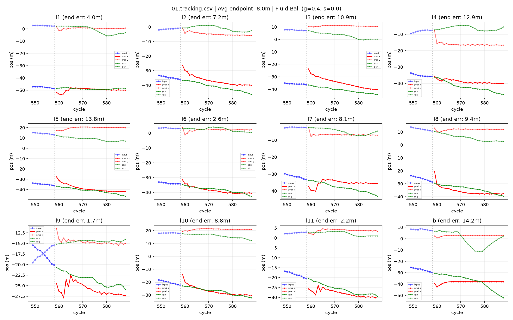
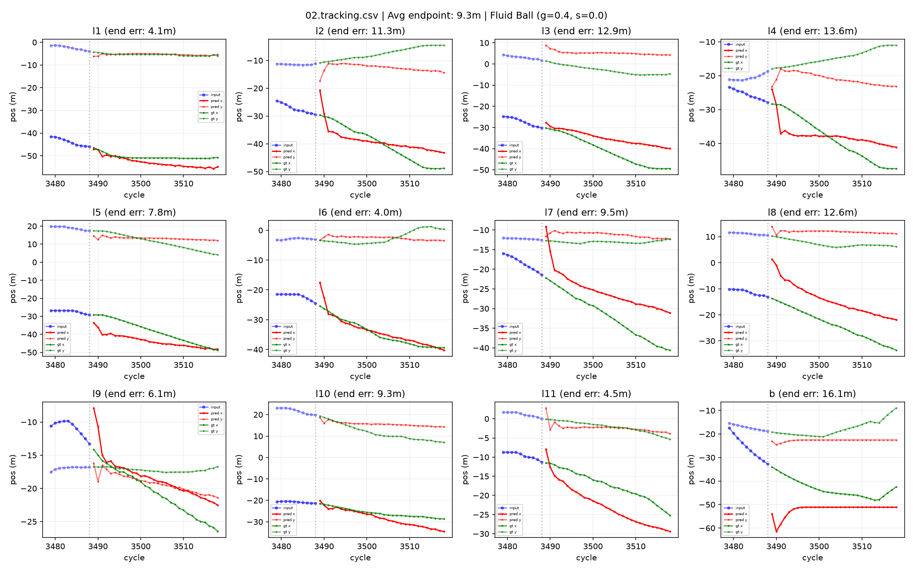
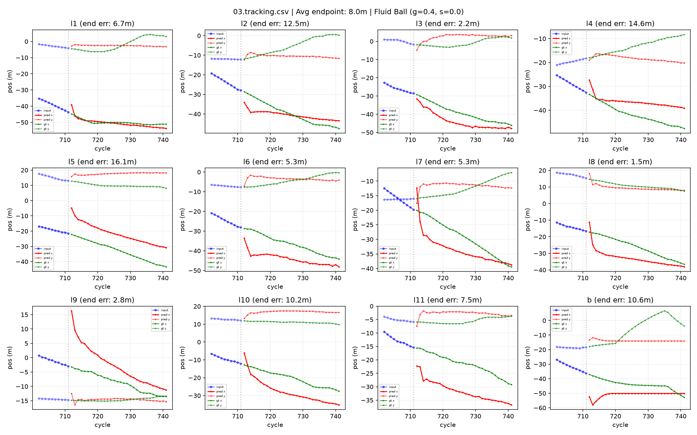

# RoboCup 2026 Soccer Simulation 2D - Trajectory Prediction Challenge

## Team: C3bots

### Approach: GTPA + Particle Filter + Fluid Ball Dynamics

This project implements a trajectory prediction model for the RoboCup 2026 Soccer Simulation 2D Challenge. The model combines:

- **GTPA (Graph Transformer with Particle Attention)**: Neural network for player trajectory prediction
- **Particle Filter (PF)**: Monte Carlo exploration with weighted consensus
- **Intercept Correction**: Velocity correction toward future ball position
- **Fluid Ball Model**: Langevin dynamics for ball trajectory prediction

## Results

### Endpoint Error Comparison (test_old dataset)

| Model | Endpoint Error | Improvement |
|-------|---------------|-------------|
| RNN Baseline | 29.87 | — |
| GTPA Baseline | 26.58 | 11% |
| **GTPA + PF + Fluid Ball** | **8.42** | **72%** |

### Per-Scene Results

| Scene | Baseline | Fluid Ball | Improvement |
|-------|----------|------------|-------------|
| 01 | 19.1m | **8.0m** | -58% |
| 02 | 37.3m | **9.3m** | -75% |
| 03 | 27.5m | **8.0m** | -71% |

### Visualization

#### Scene 01


#### Scene 02


#### Scene 03


## Methodology

### 1. GTPA Model
- Graph Neural Network with transformer attention
- Processes player interactions and temporal dynamics
- Predicts acceleration for 22 players (left + right teams)

### 2. Particle Filter
- 32 particles explore trajectory space
- Weighted consensus based on:
  - Consensus distance (how close to mean)
  - Velocity deviation from base state
  - Volterra memory (similarity to stored good trajectories)

### 3. Intercept Correction
- Corrects player velocities toward future ball position
- Parameters: β=0.5, horizon=5 steps

### 4. Fluid Ball Model (Key Innovation)
- Treats ball as particle in 2D fluid field
- Applies Langevin dynamics: v *= (1 - γ*dt)
- Optimal parameters: γ=0.4, σ=0.0
- Reduces ball prediction error from ~150m to ~15m

## Hyperparameters

```
Model: GTPA (16_20)
Epoch: 30 (best checkpoint)
Particles: 32
PF Alpha: 0.5
PF Beta: 0.5
PF Gamma: 1.0
Recursive Alpha: 0.3
Intercept Beta: 0.5
Intercept Horizon: 5
Fluid Ball Gamma: 0.4
Fluid Ball Sigma: 0.0
Perturbation Noise: 0.2
Perturbation Event: 1.0
```

## Usage

### Training
```bash
python main.py --model gtpa --data robocup2D --data_dir robocup2d_data \
    --batchsize 16 --totalTimeSteps 20 --epochs 30
```

### Inference
```bash
python main.py --model gtpa --data robocup2D --data_dir robocup2d_data \
    --batchsize 16 --totalTimeSteps 20 \
    --challenge_data test_data_2026 \
    --cont --use_perturbation --pert_noise_scale 0.2 --pert_p_event 1.0 \
    --pf_alpha 0.5 --pf_beta 0.5 --pf_gamma 1.0 --pf_num_particles 32 \
    --use_recursive_memory --recursive_alpha 0.3 \
    --use_intercept --intercept_beta 0.5 --intercept_horizon 5 --intercept_weight 0.5 \
    --use_fluid_ball --fluid_ball_gamma 0.4 --fluid_ball_sigma 0.0
```

### Evaluation
```bash
python example/evaluation.py --submit results/test/submission \
    --gt test_old/gt --input test_old/input
```

## Files

- `gtpa/model.py`: GTPA model with fluid ball dynamics
- `gtpa/particle_filter.py`: Particle filter with intercept correction
- `main.py`: Training and inference script
- `weights/gtpa_robocup2D/16_20_state_dict_best.pth`: Best model checkpoint
- `results/test/submission/stp_challenge_2026_submission.zip`: Final submission

## Citation

If you use this work, please cite:

```bibtex
@inproceedings{c3bots2026,
  title={GTPA with Fluid Ball Dynamics for Soccer Trajectory Prediction},
  author={C3bots Team},
  year={2026}
}
```

## License

MIT License
