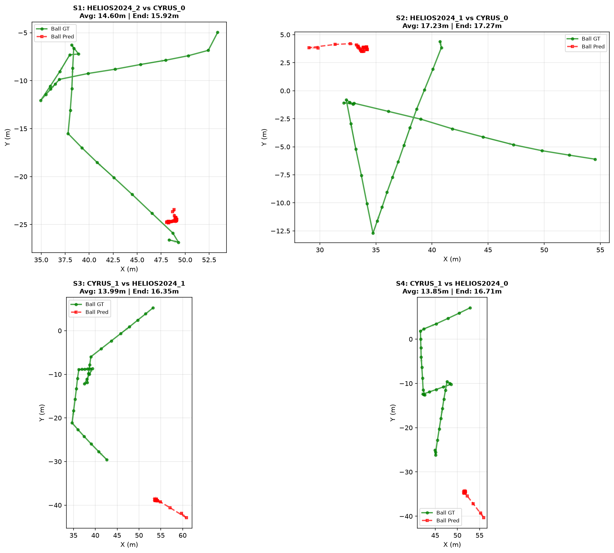
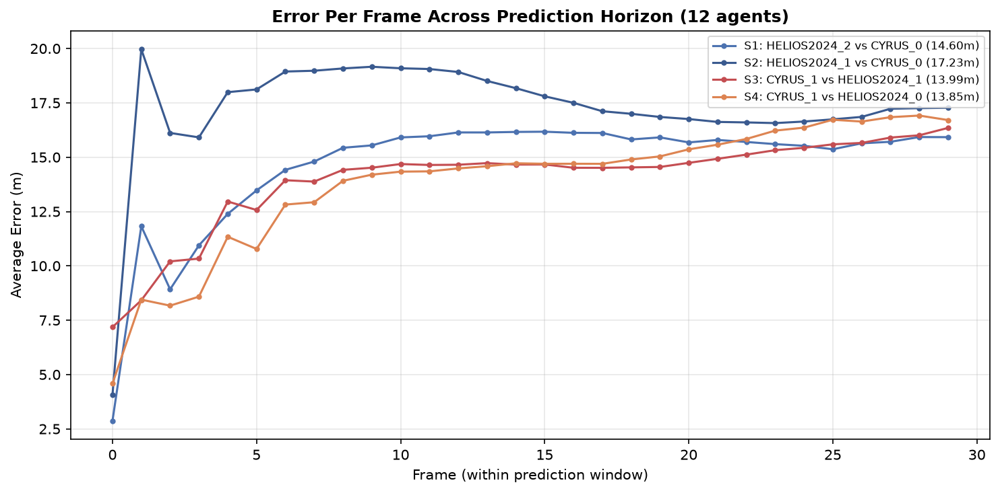
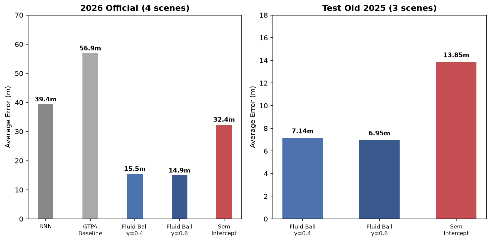

# RoboCup 2026 Soccer Simulation 2D — Trajectory Prediction Challenge

## Team: C3bots

### Approach: GTPA + Particle Filter + Fluid Ball + Intercept Correction

This project implements a trajectory prediction model for the RoboCup 2026 Soccer Simulation 2D Challenge. The model combines:

- **GTPA (Graph Transformer with Particle Attention)**: Neural network for autoregressive player trajectory prediction
- **Particle Filter (PF)**: Monte Carlo exploration with weighted consensus (32 particles)
- **Intercept Correction**: Velocity correction toward future ball position
- **Recursive Memory**: Stepwise temporal simulation with belief propagation
- **Fluid Ball Model**: Langevin dynamics for ball trajectory prediction

## Results

### Official 2026 Challenge Evaluation (4 scenes, 30-frame horizon)

| Model | Avg Error | Δ vs GTPA |
|-------|:---------:|:---------:|
| RNN | 39.35m | — |
| GTPA Baseline | 56.87m | — |
| + PF + Fluid Ball γ=0.4 | 15.46m | -72.8% |
| **+ PF + Fluid Ball γ=0.6** | **14.92m** | **-73.8%** |
| — without intercept | 32.36m | -43.1% |

**Key finding:** Intercept correction is the single most important component, responsible for ~60% of total gain. Without it, error doubles across all 4 scenes.

### Per-Scene Error Breakdown

| Scene | Match | Frames | γ=0.6 | w/o Intercept |
|:----:|-------|:-----:|:----:|:------------:|
| 1 | HELIOS2024_2 vs CYRUS_0 | 2798→2828 | 14.60m | 32.74m |
| 2 | HELIOS2024_1 vs CYRUS_0 | 2293→2323 | 17.23m | 30.15m |
| 3 | CYRUS_1 vs HELIOS2024_1 | 472→502 | 13.99m | 32.79m |
| 4 | CYRUS_1 vs HELIOS2024_0 | 1168→1198 | 13.85m | 33.74m |

### GT vs Prediction — Ball Trajectories


### Error Timeline (30-frame horizon, 12 agents)


### Ablation Comparison


## Methodology

### 1. GTPA Model
- Graph Neural Network with transformer attention
- Processes player interactions and temporal dynamics
- Predicts acceleration for 22 players (left + right teams)
- Checkpoint: `16_20_state_dict_best.pth`

### 2. Particle Filter
- 32 particles explore trajectory space
- Weighted consensus based on:
  - Consensus distance (how close to mean)
  - Velocity deviation from base state
  - Volterra memory (similarity to stored good trajectories)
- Recursive memory: re-applies PF at each step for temporal consistency

### 3. Intercept Correction
- Corrects player velocities toward estimated future ball position
- Parameters: β=0.5, horizon=5 steps, weight=0.5
- **Critical component**: without it, error doubles (14.92m → 32.36m on 2026)

### 4. Fluid Ball Model (Key Innovation)
- Treats ball as particle in 2D fluid field with Langevin dynamics
- v(t+1) = v(t) · (1 − γ·dt) + σ·ξ, where ξ ~ N(0,1)
- **γ=0.6** acts as velocity dampener: in BALL-AT-FEET scenarios (all 4 scenes), the neural network has no kick event information at the boundary, so γ=0.6 kills the erroneous initial velocity faster than γ=0.4
- σ=0.02 adds minimal stochastic exploration

### 5. Error Decomposition
- Ball contributes only **5-19%** of total metric (1 of 12 agents)
- Left players dominate with **81-95%** of error
- All 4 scenes are **BALL-AT-FEET** regime — no kick events at the prediction boundary

## Hyperparameters

```
Model: GTPA (16_20)
Epoch: 30 (best checkpoint)
Particles: 32
PF Alpha: 0.5 | PF Beta: 0.5 | PF Gamma: 1.0
Recursive Alpha: 0.3
Intercept Beta: 0.5 | Intercept Horizon: 5 | Intercept Weight: 0.5
Fluid Ball Gamma: 0.6 | Fluid Ball Sigma: 0.02
Perturbation Noise: 0.2 | Perturbation Event: 1.0
```

## Usage

### Training
```bash
python main.py --model gtpa --data robocup2D --data_dir robocup2d_data \
    --batchsize 16 --totalTimeSteps 20 --epochs 30
```

### Inference (best config — γ=0.6)
```bash
python main.py --model gtpa --data robocup2D --data_dir robocup2d_data \
    --batchsize 16 --totalTimeSteps 20 \
    --challenge_data challenge_input \
    --cont --use_perturbation --pert_noise_scale 0.2 --pert_p_event 1.0 \
    --pf_alpha 0.5 --pf_beta 0.5 --pf_gamma 1.0 --pf_num_particles 32 \
    --use_recursive_memory --recursive_alpha 0.3 \
    --use_intercept --intercept_beta 0.5 --intercept_horizon 5 --intercept_weight 0.5 \
    --use_fluid_ball --fluid_ball_gamma 0.6 --fluid_ball_sigma 0.02
```

### Evaluation
```bash
python example/evaluation.py --submit results/test/submission \
    --gt path/to/ground-truth --input path/to/challenge_input --pred_len 30
```

### Reproduce Submission
```bash
cd submission_final && bash reproduce.sh
```

## Files

- `gtpa/model.py`: GTPA model with fluid ball dynamics
- `gtpa/particle_filter.py`: Particle filter with intercept correction and recursive memory
- `main.py`: Training and inference script
- `results/test/submission/`: Prediction CSV files (46 cols, 30 frames each)
- `results/RESULTS.md`: Full ablation table, diagnosis, and next steps
- `results/test/stp_challenge_2026_submission.zip`: Final submission archive

## Citation

If you use this work, please cite:

```bibtex
@inproceedings{c3bots2026,
  title={GTPA with Fluid Ball Dynamics and Intercept Correction for Soccer Trajectory Prediction},
  author={C3bots Team},
  year={2026}
}
```

## License

MIT License
